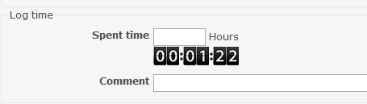

Redmine Issue Timer
===================

## Installation

Clone the Repository into your redmine/plugins folder.

Then run the following command:

```
rake redmine:plugins:migrate RAILS_ENV=production
```

## Features 

This plugin builds in a timer in the "edit issue" page to determine how long you have worked on an issue.

## Screenshot

